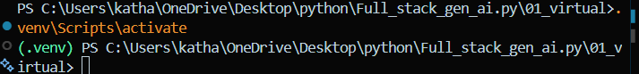
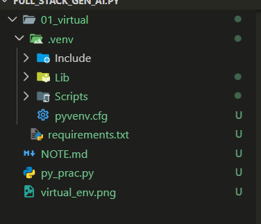

* Virtual Enviroment:: enviroment that is isolated for their system only for example: simgle python software work in diffrent laptop with old or new version
example in 01_virtual we seprately install python version

# Go to folder-> {python -m venv .venv } => activefolder {.venv\Scripts\activate}
#       this show now you you are in virtual enviroment
    Always work in venv that is good practice 
# {pip install -r requirements.txt} will install every package from that file into your current Python environment.
                <!-- isme jo bhi packages lekhe hoge sab ek sath iss command se install ho jayege -->

# The deactivate command exits your virtual environment and returns to your system Python.

    ==> traditional way using virtual enviroment

{{{{{{{{{{{{{{{========================================================}}}}}}}}}}}}}}}

* PYTHON REVISE NEEDED:: 
# Everything is object in Python.

# Datatype:
    :  object contain : identiy {change}
                       : type
                       : value  {not change}
       when this happen a=2 
                    a=4 then  refernce change when print value not change

   * Mutable ans immutable work on value

   
# swap program:
 a,b=1,2
print(f"value of a {a} , value of b {b}")
b,a=a,b
print(f"value of a {a} , value of b {b}")

# Bytearray::  return a new array in bytes , mutable sewuesnce in range of 0 to 256

# SET: uniqueness , mutable
    Common set operators
    A | B : union
    A & B : intersection
    A - B : difference
    A ^ B : symmetric difference

# Fronzenset: Immutable , unordered collection of unique element

# Ternary operator:  value_is_true  if  condition else value_is_false
           ex: "Adult" if age>=18 else "Minor"

# Range , Enumerate

